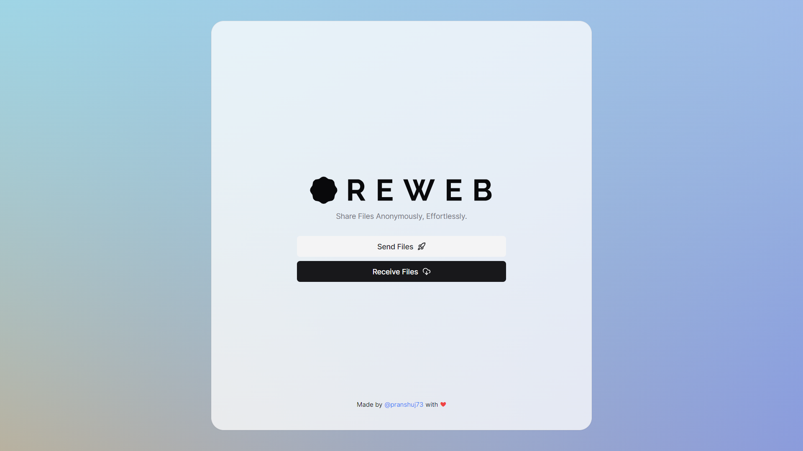

<h5 align="center">Share Files Anonymously, Effortlessly.</h5>

<br />
<hr />
<br />

# Oreweb

A P2P based File Sharing Application. Made with NextJS and PeerJS.


## Demo

Try it out at: https://oreweb.vercel.app
## Screenshots




## Contributing

Contributions are always welcome!

See `contributing.md` for ways to get started.

Please adhere to this project's `code of conduct`.


## Tech Stack

**Client:** Next JS, TailwindCSS, shadcn-ui (RadixUI)

**Server:** Node, PeerJS


## Run Locally

Clone the project

```bash
  git clone https://github.com/pranshuj73/oreweb.git
```

Go to the project directory

```bash
  cd oreweb
```

Install dependencies

```bash
  npm install
```

Start the server

```bash
  npm run dev
```


## License

[MIT](https://choosealicense.com/licenses/mit/)


## Authors

- [@pranshuj73](https://www.github.com/pranshuj73)

